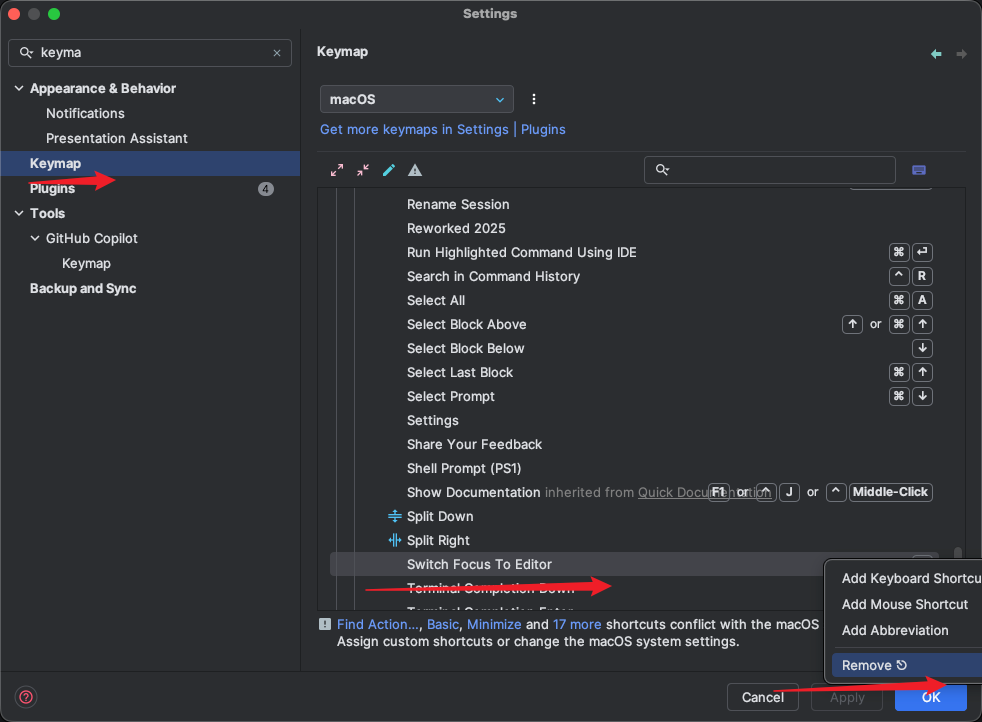

# Troubleshooting

English | [简体中文](troubleshooting_CN.md)

## 1. Why does pressing the `Esc` key exit the terminal in IDEA?

Remove the `Esc` key binding as shown below.



## 2. Why does typo fail or the terminal behave abnormally when using Ghostty over SSH?

> Strictly speaking, this is a Ghostty terminal issue rather than a typo issue.

Common symptoms:

- Repeated input characters
- Pressing `Delete` inserts spaces or behaves unexpectedly
- `missing or unsuitable terminal: xterm-ghostty`
- `Error opening terminal: xterm-ghostty`
- `WARNING: terminal is not fully functional`

Root cause:

- Ghostty prefers `TERM=xterm-ghostty` to advertise its terminal capabilities.
- If the remote machine does not have the `xterm-ghostty` `terminfo` entry installed, terminal applications over SSH may fail or behave incorrectly.

Recommended fixes:

1. Prefer installing Ghostty's `terminfo` entry on the remote host:

   ```bash
   infocmp -x xterm-ghostty | ssh YOUR-SERVER -- tic -x -
   ```

2. If installing `terminfo` is not practical, configure SSH to fall back to a widely supported terminal type in `~/.ssh/config`:

   ```sshconfig
   Host example.com
     SetEnv TERM=xterm-256color
   ```

Additional notes:

- The fallback approach requires OpenSSH 8.7 or newer.
- `xterm-256color` is only a compatibility fallback and does not expose all Ghostty-specific terminal features.
- If you use Ghostty shell integration, `shell-integration-features = ssh-terminfo` can install the remote `terminfo` automatically, and `shell-integration-features = ssh-env` can configure the SSH fallback automatically.
- If both `ssh-terminfo,ssh-env` are enabled, Ghostty tries to install the `terminfo` entry first and falls back only if installation fails.
- On macOS versions earlier than Sonoma, the bundled `infocmp` is too old for this workflow. Install a newer `ncurses` via Homebrew and use `/opt/homebrew/opt/ncurses/bin/infocmp` or `/usr/local/opt/ncurses/bin/infocmp` instead.

See: https://ghostty.org/docs/help/terminfo#ssh

## 3. Why doesn't the `Esc` binding work in a JetBrains Remote IDE terminal launched via Gateway?

This appears to be a JetBrains IDE limitation. Change the binding in `typo init zsh` to another key, and it should work again.

```shell
bindkey '\e\e' _typo_fix_command

->

bindkey '^T' _typo_fix_command
```
